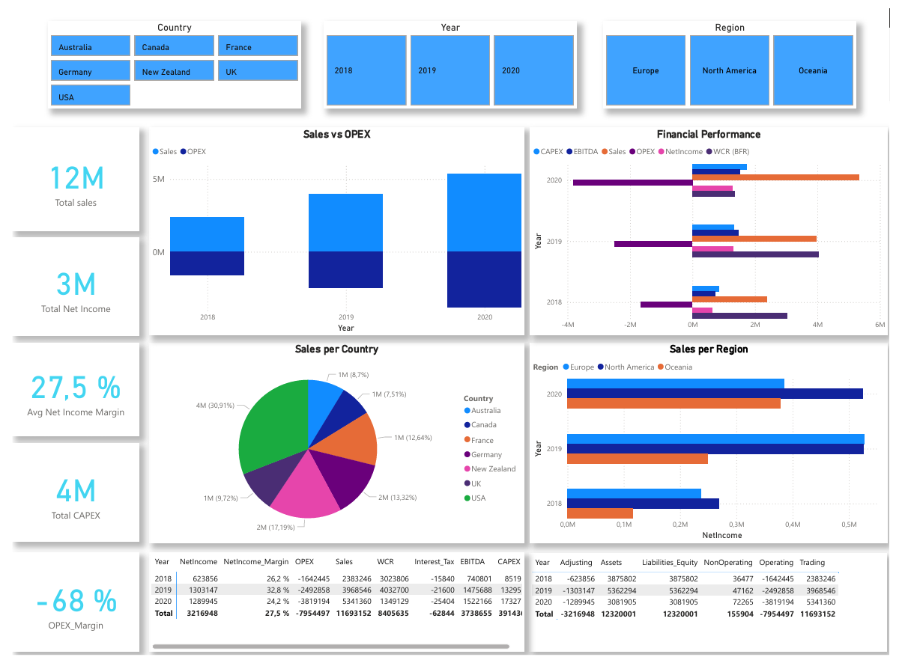

# Financial Data Analytics & KPI Automation

A pragmatic, end-to-end finance data pipeline that turns a raw, multi-sheet Excel into clean, auditable KPIs—then hands them to Power BI for decision-making. The point isn’t to look fancy; it’s to be reliable, reproducible, and handoff-ready for BI teams.

---

## Repository at a glance

---

## What this pipeline does

- Ingests a workbook with `GL`, `Chart of Accounts`, `Calendar`, `Territory`.
- Cleans unnamed/empty columns and normalizes text fields.
- Enriches the General Ledger with account metadata, calendar (Year/Quarter/Month/Day), and territory (Country/Region).
- Computes KPIs with explicit formulas:
  - Sales (CA) = sum where `Class = "Trading account"`
  - OPEX = sum where `Class = "Operating account"`
  - EBITDA = Sales + OPEX
  - Interest & Tax = sum where `Class = "Interest & Tax"`
  - Net Income = Sales + OPEX + Non-operating + Adjusting − Interest & Tax
  - WCR (BFR) = Current Assets − Current Liabilities
  - CAPEX = detected via `Details` (“purchase of …”) or PPE/Intangibles fallback
- Exports a tidy Excel:
  - Enriched ledger
  - Class-by-year breakdown
  - KPI table by year  
  → [`data/processed/financial_kpis.xlsx`](data/processed/financial_kpis.xlsx)

---

## Dashboard (Power BI)

- Editable: [`dashboard/KPIs.pbix`](dashboard/KPIs.pbix)  
- Read-only: [`dashboard/KPIs.pdf`](dashboard/KPIs.pdf)

Preview:

The report surfaces the KPI panel, trends by year, and breakdowns by account class and geography.

---

## Why this project matters

- **Traceable**: KPIs are computed from transparent account classes and documented rules.  
- **Hand-off friendly**: processed Excel + `.pbix` lets BI iterate without touching Python.  
- **Tolerant to messy sources**: normalization and CAPEX fallback help when “real-world” data isn’t perfect.  
- **Before → After**: both raw and processed files are in the repo to show the added value clearly.

---

## Run locally (Windows)

1. Place the input file at:

2. Run the notebook `netoyage.ipynb` to generate:

3. Open `dashboard/KPIs.pbix` in Power BI Desktop. If needed, repoint the data source to the processed Excel.

> Tip: clear notebook outputs before committing to keep the repo clean.

---

## Quick insights (demo data)

- Sales increased from 2018 to 2020; EBITDA grew then flattened.  
- WCR (BFR) weakened in 2020, hinting at tighter liquidity.  
- CAPEX remained significant, consistent with asset investment.  

---

## Next steps

- Automate scheduling (Airflow / ADF) and data quality checks.  
- Extend KPIs (cash flow, leverage/coverage ratios).  
- Add unit tests around joins and KPI formulas.

---

**Note**: this repository is for demonstration/education. Replace or anonymize data according to your organization’s policies.
